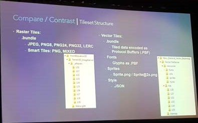

<!-- Presenter: Renardi Tanuwidjaja -->

#### Esri Developers Summit 2019
<br> 
# Summary Notes
<br>
#### [Renardi Tanuwidjaja](renardi.tanuwidjaja@arup.com)
#### [Yijun Tay](yijun.tay@arup.com)

---

[//]: # (NEW SECTION)

# ArcGIS API for JavaScript

------

## What's new in 4.11?

------

### Performance (feature layers)

- Query in an efficient way - feature tiles & caching
- Minimise size of data delivered to browser - Protocol Buffer Format (PBF) - binary
- HTTP/2 protocol - decrease latency
- Fast rendering - use WebGL for all layers
- Cachable

------

### Filter

```
featureLayerView.filter()
```

- Client-side filtering and applied effects
- Filter function uses CPU to run client side query vs. visual variables uses GPU (better performance)
- Example: [Flash Flood Warning](https://ekenes.github.io/conferences/ds-2019/plenary/flash-flood-warnings/index.html)

------

### Dot Density

- Example: [Dot Density - U.S. Population by Race](https://ekenes.github.io/conferences/ds-2019/plenary/dot-density-legend/index.html)
- Example: [Dot Density - Housing growth](https://ekenes.github.io/conferences/ds-2019/plenary/dot-density-housing/index.html)

------

### GeoJSON Layer

- Example: [USGS Earthquake](https://ycabon.github.io/2019-devsummit-plenary/2_geojson.html)

------

### Time

- Time metadata
- Query by time extent
- Time based filter and effect
- Example: [USGS Seismic Activity](https://richiecarmichael.github.io/quake-map/index.html)

------

### Custom WebGL Layer Views

- Now available for 2D
- Example: [Dario D'Amico Github](https://github.com/damix911/ds-demo-2019)


------

### 3D Sketch Editing

- SketchViewModel()

<!-- .slide: data-background-video="assets/videos/js-api_3d-sketch.mp4" -->

------

### glTF Support

- For symbology (e.g. asset from sketchpad)
- Mesh API to create custom 3D model


------

### High DPI

- Automatically adjusts for 4K

------

### Editing

- Editing - form based editing, feature template, create and update features
- Editor widget looks for editable layers configured in Online or Enterprise
- Advanced attribute editing
- Expression based visibility for featureform
- Currently (4.11) can't edit related records, attachments and no snapping, WIP for future releases
- Presentation: [Web Editing with the ArcGIS API for JavaScript](https://github.com/jcfranco/dev-summit-2019-web-editing-with-the-js-api)
- Example: [Julie Powell's Codepen](https://codepen.io/julie_powell/)

------

### Editing - Editor Widget

[](https://jcfranco.github.io/dev-summit-2019-web-editing-with-the-js-api/demos/basic-editing/)

------

### Editing - Feature Form

[](https://developers.arcgis.com/javascript/latest/sample-code/editing-groupedfeatureform/index.html)

------

### Editing - Advanced Form Based Editing

[](https://jcfranco.github.io/dev-summit-2019-plenary-demos/form-based-editing/)

------

### Arcade

- Access data in popups with arcade expressions
- Presentation: [ArcGIS API for JavaScript: Using Arcade with Your Apps - Kristian Ekenes, MohanRaj Balumuri](https://github.com/ekenes/conferences/tree/master/ds-2019/arcade)

------

## Other JS Related News

------

### Vector Tile Style Editor

- Option to update rendering in view without reload

[](https://developers.arcgis.com/vector-tile-style-editor/)

------

### New JS API Homepage

- DevLabs (now Tutorials) rehaul and improvements
- New App Showcase
- Sandbox update:
  - Color scheme as github
  - Hover over require statement to take you to docs
  - Ctrl + click URLs and item ids
  - Save locally
  - Keyboard shortcuts

------

### 3D - JS API Features and Integration with BIM

- Slice tool widget (currently only horizontal/vertical)
- Isolation tool widget

<iframe width="560" height="315" src="https://www.youtube.com/embed/gnch_gCGe5A" frameborder="0" allow="accelerometer; autoplay; encrypted-media; gyroscope; picture-in-picture" allowfullscreen></iframe>

------

### 3D - Slice Widget

<iframe class="snippet-preview" id="widget-slice" data-src="./assets/snippets/widget-slice.html"></iframe>

[Example](https://esri.github.io/devsummit-2019-3D-jsapi/3d-maps-with-the-arcgis-js-api-beyond-the-basics/#/28)

------

### 3D - Canvas Background

<iframe class="snippet-preview" id="widget-slice" data-src="./assets/snippets/setup-background.html"></iframe>

[Example](https://esri.github.io/devsummit-2019-3D-jsapi/3d-maps-with-the-arcgis-js-api-beyond-the-basics/#/20)

------

### 3D - Basemap Transparency

- Available since 4.9

<iframe class="snippet-preview" id="widget-slice" data-src="https://developers.arcgis.com/javascript/latest/sample-code/sceneview-underground/live/index.html"></iframe>

------

### 3D - External Renderer

<!-- .slide: data-background-video="assets/videos/js-api_external-renderer.mp4" -->

------

### 3D - Memory and Quality

[Example](https://esri.github.io/devsummit-2019-3D-jsapi/3d-maps-with-the-arcgis-js-api-beyond-the-basics/#/40)

------

### 3D - Feature limits

- Last release of JS API removes limit of features for 2D BUT still a limit 50000 for 3D
- Can adjust max feature limit, but will then ignore under the hood monitoring of memory usage. JS API by default monitor memory usage and reduces quality as required.

------

### Smart Mapping and Data Driven Styling

- Multivariate colours


------

### Recommendations for Performance - Apps

- Lazy load
- Use fewer map layers
- Specify outfields in feature layers
- Simplify rendering
- Use Web Workers API to load resources later

------

### Recommendations for Performance - Scenes

- Publish Scene Layers with ArcGIS Pro 2.3
    - Oriented bounding boxes instead of spherical extents
- Use tilt constraints
    - More tilt = more to load
```
view.constraints.tilt.max = 50
```

------

### Recommendations for Performance - Scenes (cont)

- Absolute height loads faster than relative height
- Apply lower quality profile for atmosphere effects
```
const view = new sceneView({
    qualityProfile: "low"
});
view.environment.atmosphere.quality = "low";
```

------

### Recommendations for Performance - Scenes (cont)

- Avoid shadows if not necessary
```
view.environment.lighting.directShadowsEnabled = false;
```
- Avoid ambient occulusion 
```
view.environment.lighting.ambientOcclusionEnabled = false;
```

------

## JS API - The Road Ahead

------

### Roadmap

- Next gen map maker for 4.12


------

### Arcade Enhancements

- view geometry
- angle
- geodesic distance
- featureset
- related records
- attachments - mainly to support requirements for utility networks

------

### Application Sliders

- Built-in styled sliders

------

### Magnifier

- Use case for editing
- Offset magnifier for finger editing


------

### Feature Layer

- Snapping
- Snapshot edit mode
- Layer view enhancements
- More projection engine intergration
- Clientside joins
- Computed fields

------

### Feature Layer

- Clipping
- Masking
- Blending
- Extensibility of feature rendering
- Clustering - similar to 3.x

------

### Time

- Animation time slider widget
- Temporal tracking
- Flow
- 2D and 3D

------

### Api Modernization

- Remove dojo loader plugins and move to native promises
- Load on demand
- Leverage latest browser tech

------

### Vector Marker Symbols

- Built from ArcGIS Pro CIM (Cartographic Information Model - [Spec](https://github.com/Esri/cim-spec))
- Multi layer symbol, can take advantage of CIM size and color overrides


------

### Rendering Quality

- Line and polygon styles
- Water rendering
- Path symbol improvements


------

### Camera Navigation

- 3D scene rotation - north will stay north now
- Continue with making slight improvements

------

### Esri JS Dev Team and Their Awesome Work

- Kristian Ekenes [github/ekenes](https://github.com/ekenes)
- Yann Cabon [github/ycabon](https://github.com/ycabon)
- Rene Rubaclava [github/odoe](https://github.com/odoe)
- Juan Carlos Franco [github/jcfranco](https://github.com/jcfranco)
- Raluca Nicola [github/RalucaNicola](https://github.com/RalucaNicola)

---

[//]: # (NEW SECTION)

# Python

------

### Python - ArcGIS Platform

- Support for Python 2 (python.org) ends this year - moving to Python 3 for ArcGIS Pro, Runtime, Hosted Notebook, ArcGIS API for Python
- Jupyter Notebook available out of the box on ArcGIS Pro and as hosted notebook on Enterprise 10.7 and AGOL later this year

------

### Python - ArcGIS Platform

- ArcGIS API for Python to orchestrate and automate Enterprise or Server
  - package scripts and run tools on your server
  - execute dynamically or in distributed fashion
- Python in the Runtime stack - deeper access to geoprocessing tools
- ArcPy package in conda environment (ArcGIS Pro):

```
conda install -c esri arcpy
```

------

### Python - Cartographic Information Model (CIM)

- More access to the CIM (symbology) - arcpy.mp module
- [CIM Specification](https://github.com/Esri/cim-spec)
- Represented in JSON

------

### arcpy.mp - CIM

```
sym = lyr.symbology.renderer.symbol
cim_lyr.Renderer.Symbol.SymbolLayers
.Color.Values = ...
lyr.setCIM(cim_lyr)
```

------

### Python in ArcGIS Pro

- Pro Python installed packages
- Pro Python package manager to manage environments, clone and save to local drive


------

### Example: DCRA Story Maps

- The DCRA in Alaska has a story map for each of its 347 communities
- Created an example of automation using the Python API and the new Story Maps module
- Code on GitHub: http://p.ctx.ly/r/974m

------

### Building Geoprocessing Tools

- Validation 
- Code organisation
    - Python toolboxes vs Script tools
- Debugging Python in Pro using Visual Studio
- Toolboxes as Packages
- Publishing Geoprocessing Services

------

### Building Geoprocessing Tools

- Slides: https://github.com/dWynne1/ds19-building-tools

---

[//]: # (NEW SECTION)

# Data Science & Machine Learning

------

### Hosted Python Notebooks

- Available in Enterprise 10.7 at end of March and AGOL later in the year
- Use ArcGIS API for Python with external modules and frameworks
- [Sample Notebooks](https://developers.arcgis.com/python/sample-notebooks/)

------

### Spatial Analysis & Data Science in ArcGIS Pro

- Use ArcGIS API for Python with model builder and built in regression

<iframe width="560" height="315" src="https://www.youtube.com/embed/cNynzdFbhZ8" frameborder="0" allow="accelerometer; autoplay; encrypted-media; gyroscope; picture-in-picture" allowfullscreen></iframe>

------

### Raster Analytics

- Example: drone cost surface analysis
  - Use raster functions for cost analysis, optimum route paths and navigation/flight planning purposes
  - Can be taken to hosted python notebooks

<iframe width="560" height="315" src="https://www.youtube.com/embed/xqxGE-t0oIo?start=405" frameborder="0" allow="accelerometer; autoplay; encrypted-media; gyroscope; picture-in-picture" allowfullscreen></iframe>

------

### Deep learning in ArcGIS

- 2 aspects: built within ArcGIS Pro AND ArcGIS API for Python
- arcgis.learn module
- Example: pavement cracks
  - Use TensorFlow to go through dashcam frames and identify different types of cracks
  - Map cracks on arcgis.
  - Result layers visualised on webmap and dashboard for presentation

------

### Deep learning in ArcGIS

<iframe width="560" height="315" src="https://www.youtube.com/embed/9bYtfoOeN7I" frameborder="0" allow="accelerometer; autoplay; encrypted-media; gyroscope; picture-in-picture" allowfullscreen></iframe>

------

### GeoAnalytics Server

<iframe width="560" height="315" src="https://www.youtube.com/embed/oiZlfh5stDo" frameborder="0" allow="accelerometer; autoplay; encrypted-media; gyroscope; picture-in-picture" allowfullscreen></iframe>

------

## GeoAI: Integrating Machine Learning with ArcGIS

------

### Example 1 - Natural Language Processing

- Issues with unstructured data into GIS
- ML integrating with external frameworks, e.g. TensorFlow, NetOwl etc.
- Entities and relationships (in text):
  - spatial entities like name of countries, address, coordinates, etc.
  - non-spatial entities like names, person, dates, etc.
- Use NetOwl to go through .txt, extract spatial elements and related elements, then convert to point features
- NetOwl API output - text, section, entity, link, event.. then can tie in geocoding after

------

### Example 2 - Cognitive Services & Survey123

- ArcGIS + Azure - insight for images captured with Survey123
- Azure cognitive services - Computer Vision API
- Example - to find bicycles in images from Survey123
- Survey123 data Feature Service > webhook to trigger when data comes in > Azure function in python > Computer Vision API > JSON
- All in ArcGIS Online
- Added azure computer vision tags field and boolean field whether there is a bicycles or not
- View in Ops Dashboard

---

[//]: # (NEW SECTION)

# ArcGIS Platform - Online, Enterprise & Cloud (SaaS)

------

### What's New?

- Enterprise 10.7
- Hosted Python Notebook
- ArcGIS Insights
- ArcGIS Hub
- ArcGIS Indoors
- ArcGIS Urban
- Realtime analytics IoT

------

### Online & Enterprise - Photos

- Add photos with location data (EXIF)
- Query string, e.g. https://...?w=300

------

### Extending and Automating your Enterprise

- All in one deployment using Enterprise Builder
- Distributed multi node deployments using chef and powershell
- Webhooks and ArcGIS API for Python
- Attribute rules, batch validation and calculation - Arcade expressions
- ArcObjects will continue to be supported, resources on github

------

### Webhooks

- Webhooks for Portal events: 1. Register, 2. Webhooks get called, 3. Do something.
- Register webhooks through Portal admin page
- Can use flow, powerBI connector and others when webhooks triggered
- Example - automated curator bot:
  - Python code in AWS lambda
  - Inspect layer metadata
  - Automatically fill in metadata then send email

------

### OpenStreetMap Vector Basemap

- [OSM Basemap](https://www.arcgis.com/home/item.html?id=fae788aa91e54244b161b59725dcbb2a)

------

### Hosted Feature Layer View

- Create and use different views of one Hosted Feature Service
- For different user groups

------

### ArcGIS Online: Sharing Model & Authentication

- Release 19 March 2019
- 210863 total org, 12000 new users per day 46000 new items per day, typical 12000 users login per hour

------

### ArcGIS Online: Sharing Model & Authentication

- Previously level 1 and 2 users only and custom user roles
- Now capable to assign user types


------

### ArcGIS Online: Sharing Model & Authentication

User Types App Bundles


------

### ArcGIS Online: Sharing Model & Authentication

User Types vs User Roles


------

### ArcGIS Online: Sharing Model & Authentication

- Authentication - 3 ways:
  - ArcGIS Online authentication
  - Enterprise logins using SAML and OAuth
  - Social logins
- Options for multifactor authentication and password policy
- Social logins use case mostly for subconsultants

------

### ArcGIS Online: Sharing Model & Authentication

Named user login vs app login
- App login:
  - app authenticates on behalf of users - no need for named user account
  - content must be publicly accessible
  - app secret should not be exposed in source code (use proxy page)
  - credit consumption taken by owner
  - security layer on top of app

------

### ArcGIS Online: Admin

- Organization status dashboard
- ArcGIS Online orgnisation API for logs and other info for audit (only available on ArcGIS Online, slightly different on Enterprise)

------

### ArcGIS Online: 19 March Update


------

### ArcGIS Online: Road Ahead


---

[//]: # (NEW SECTION)

# ArcGIS Pro

------

### ArcGIS Pro Update

- Aiming to achieve parity with ArcMap
- Ability to publish to ArcGIS Server in future release
- Option to cache locally for scene layers, vector and raster tiles
- Integration with AutoDesk
- Cut and fill tool (under development)
- Profile viewing tool (under development)

------

### ArcGIS Pro SDK for Microsoft .NET

- Use to modify, customise and add new plugins to ArcGIS Pro
- Can achieve custom branding and looks for ArcGIS Pro

---

[//]: # (NEW SECTION)

# Web AppBuilder

------

### Resources

- Presentation: [WAB Tools & Techniques](https://gavinr.github.io/web-appbuilder-tools-techniques-dev-summit-2019/)
- esriurl.com/wabtools2019
- https://github.com/gbochenek/wab-test-example

------

### Experience Builder

- New Product! 
- Card-based website builder


------

### Developer Knwowledge

- Running React under the hood
- Skills needed for development - React + TypeScript

------

### Product Timeline

- June 2019 - Beta Release (Developer Edition and Online Edition)
- Q4 2019 - Final Release (Developer Edition and Online Edition)
- Early 2020 - Final Release (Enterprise Edition)

---

[//]: # (NEW SECTION)

# ArcGIS Runtime SDK

------

### Working offline workflows
- ArcGIS Pro - create .mpkg and sideload to app
- ArcGIS Online - enable offline mode

<iframe width="560" height="315" src="https://www.youtube.com/embed/p794SXq1wrI" frameborder="0" allow="accelerometer; autoplay; encrypted-media; gyroscope; picture-in-picture" allowfullscreen></iframe>

------

### GIS App Development

- Samples and open source apps on github - https://developers.arcgis.com/arcgis-runtime/

<iframe width="560" height="315" src="https://www.youtube.com/embed/yDxsPNwUo9U" frameborder="0" allow="accelerometer; autoplay; encrypted-media; gyroscope; picture-in-picture" allowfullscreen></iframe>

---

[//]: # (NEW SECTION)

# ArcGIS Indoors

------

### ArcGIS Indoors - What is it?

- Wayfinding app
- First release capabilities:
  - Data curation and map making
  - Routable network creation
  - Web and mobile wayfinding (point to point at this stage but not live)
  - Mobile indoor positioning
  - Device tracking
  - Location sharing
- First release focus on occupant/visitor and map maker

------

### ArcGIS Indoors - How it works?

- ArcGIS Pro - import CAD
- Geoprocessing tool - Floorplans to indoors tool (part of indoors toolbox)
- Inherently 3D data, can bring straight into webscenes
- Can create mobile map packages
- Indoors networks tool > generate pathways, thin pathways
- Transitions - elevator and stairs paths to connect different floors
- Share as web scene and network services

------

### ArcGIS Indoors - What else?

- ArcGIS Online doesn't support network services yet, but enterprise does currently
- Map services can be consumed in ArcGIS Indoors (utilises the JS API)
- Can link to Survey123
- Support timed events

------

### ArcGIS Indoors - What else?

- Licensing is per square foot and not by named user
- Indoor positioning system - bluetooth, wifi and gps to get that blue dot
- Run initial survey to get a fingerprint of the indoor space, i.e. at a particular location, what signal profile, etc. 
- Smart lighting (acuitybrands, atrius), and wifi positioning systems (aruba, cisco). Esri is currently doing the testing with the partnership

---

[//]: # (NEW SECTION)

# Caching and Vector Tiles - Best Practices

------

### Vector Tiles - Overview


------

### Vector Tiles - Overview

- Vector tiles in ArcGIS leverages open source projects
- Uses mapbox vector tile spec
- Based on google protocol buffers
- Styling conforms to the mapbox gl style spec
- Vector tiles not just the recommended web mercator but also can use other coordinate systems

------

### Advantages of Vector Tiles

- Display quality
- Dynamic labelling - independent rotation

------

### Example: Vector Tile Basemap

<iframe class="snippet-preview" id="widget-slice" data-src="https://tfauvell.github.io/vt-styles-js/"></iframe>

- Github: [tfauvell/vt-styles-js](https://tfauvell.github.io/vt-styles-js/)

------

### Example: Vector Tile Style

<iframe class="snippet-preview" id="widget-slice" data-src="https://gbochenek.github.io/vector-tile-demo-js/"></iframe>

- Github: [gbochenek/vector-tile-demo-js](https://gbochenek.github.io/vector-tile-demo-js/)

------

### Vector Tile Style Editor

- Edits the style.json

[](https://developers.arcgis.com/vector-tile-style-editor/)

------

## Comparing Raster Tiles vs. Vector Tiles

------

### Authoring Clients/Tools


------

### Tileset Structure



------

- Tile cache Data Store specifically only for 3D scene layers. Vector tiles only uses relational Data Store.
- Raster tiles for entire world is ~20TB and will take weeks to cache vs. vector tiles for entire world is ~40GB and ~12hrs to cache.
- Will need webgl and new tech on clientside to deal with vector tiles rendering

------

### Supporting Architecture


------

### Common Basemaps


------

### Caching - What's new in ArcGIS Enterprise 10.7 and Online?


------

## Optimising Maps for Cache Generation

------

### Data

- Use local FGDB
- Clean your data - eliminate duplicates, check/fix geometries
- How dense is your data - set reasonable scale dependencies, generalise

------

### Cartography

- Dont start from scratch on ArcGIS Pro, can import MXD from ArcMap
- Set your scales according to the tiling scheme you select
- Note scale logic in Pro is different from ArcMap
- Convert representations to unique value symbols

------

### Cartography

- Limit:
  - number of layers
  - duplication of content
  - inclusion of additional fields/data in the tileset
- Avoid:
  - group layers (1-2 layers is ok)
  - complex symbols and unsupported symbol effects (hatches/gradient fills)
  - unsupported layers

------

### Optimising Your Maps

- Uncheck the box "draw up to and including maximum scale in scale ranges"
- Pick a tiling scheme and set scale properties to match
- Copy data to FGDB
- Get your data healthy
- Make a valid map
- Make an efficient map
- Annotations, dimensions, map effects won't cook

------

## Optimising Raster Tiles

------

### Raster Mosaic

- Use mosaic dataset footprints instead of raster datasets


------

### Raster Tiles - ArcGIS Server Configuration


------

### Raster Tiles - Cache Jobs


------

### Raster Tiles - ArcGIS Server Scalability


------

### Optimising Raster Tile Generation


------

### Notes on Publishing Tile Layers

- ArcGIS Pro, share as web layer, cache manually locally
- Raster tile, share as image layer from a mosaic dataset

------

### Summary


------

## NEVER CACHE ON PRODUCTION SERVER!

---

[//]: # (NEW SECTION)

# Miscellaneous

------

### ArcGIS Living Atlas

- Collection of data around the world
- Live feeds as hosted feature layers (beta)
- https://livingatlas.arcgis.com/en/

------

### VR, AR, MR

- Devices moving to inside out approach
- New HoloLens features
- Google global positional tracking
- ArcGIS 360 VR - currently an Esri lab project, full offering in the future
- AuGeo app
- ArcGISRuntimeARVRBeta@esri.com for developer beta access
- ArcGIS runtime currently focused for AR, not VR/MR

------

### Optimising 3D Data Content

- Pro 2.3 can share Building Scene Layer
- Indexed 3D Scene Layer (i3s) Spec - OGC Community Standard
- [Esri/i3s-spec](https://github.com/Esri/i3s-spec)
- Edit Feature Layer attached to Scene Layer through ArcGIS Pro then rebuild scene layer, then script
- So far only in Enterprise 10.6+, same rebuild edit capabilities will be available in ArcGIS Online soon

------

### Esri Geoportal Server

- Free, open source product to manage and publish metadata and data catalog
- [Geoportal Server website](https://www.esri.com/en-us/arcgis/products/geoportal-server/overview)
- [Geoportal Server Github](https://github.com/Esri/geoportal-server)

------

### Other

- Layer ordering for feature layers will be implemented when WAB go to 4.x
- 2nd half of 2020 for full service on containers
- Enterprise builder, then working towards deployment containers
- EGDB - a synonym of SDE
- GeoJSON layer in 4.11, refresh capabilities in 4.12 - limitations with size for large data, feature tiled layers preferred
