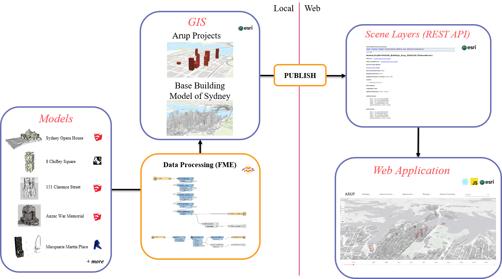
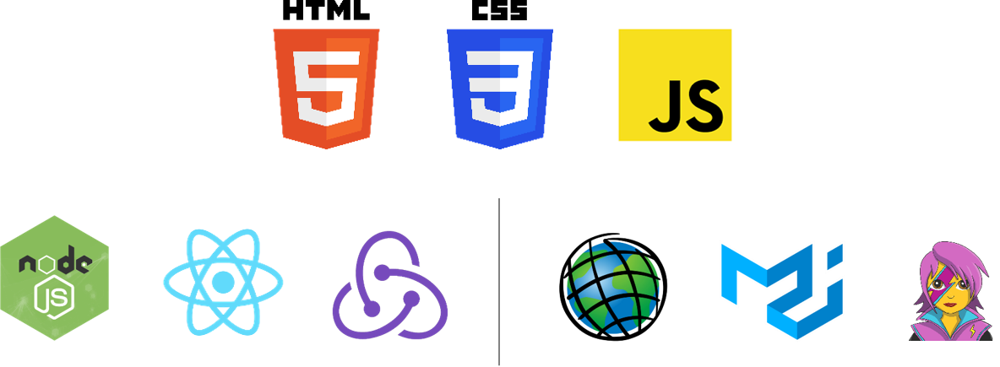
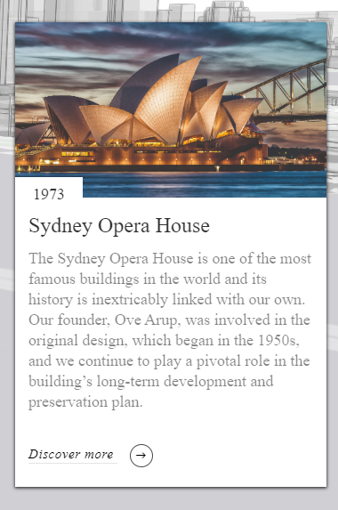
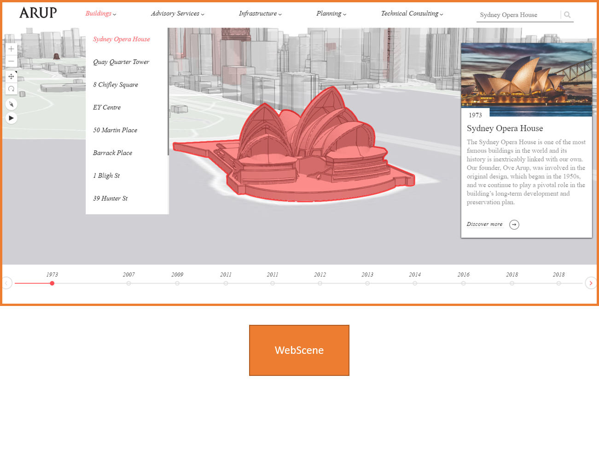
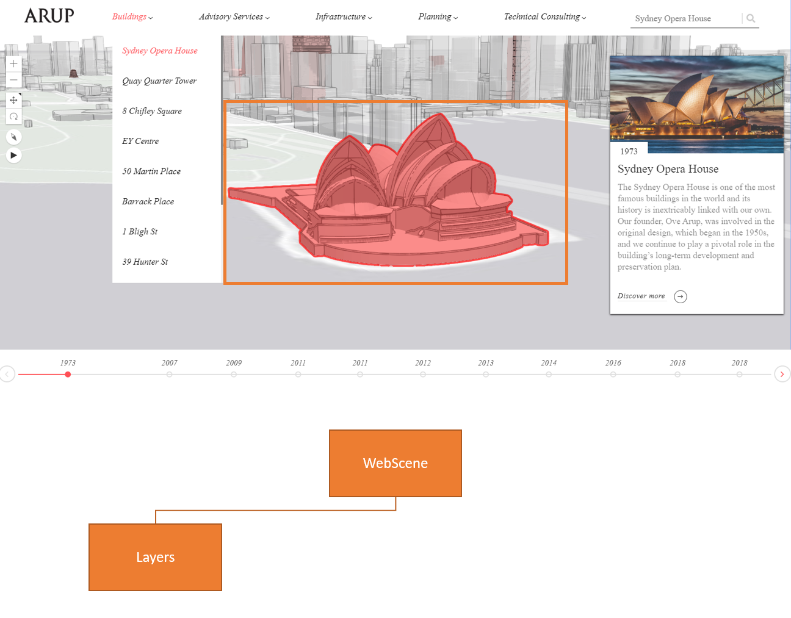
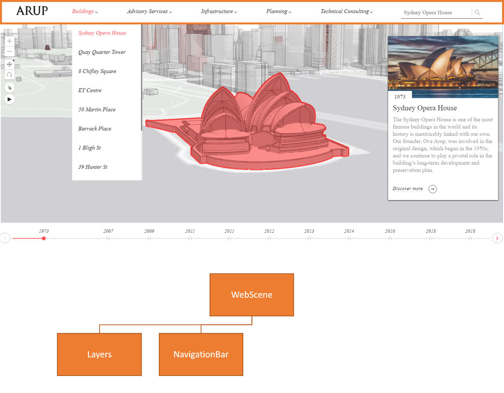
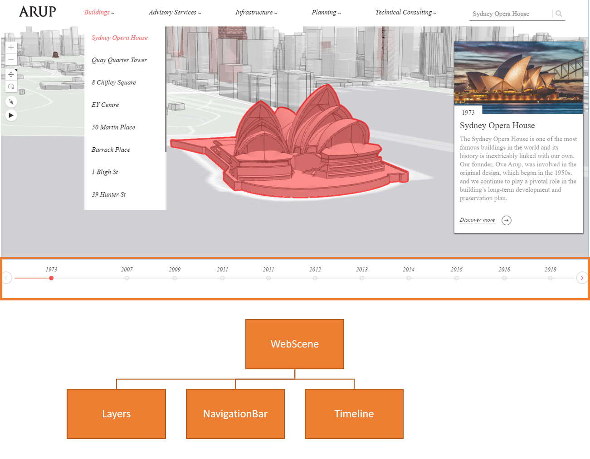
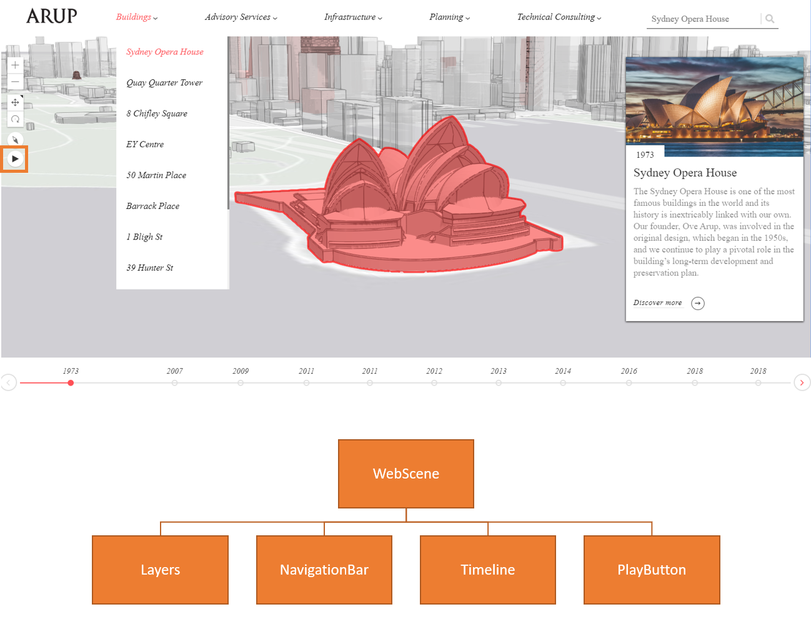
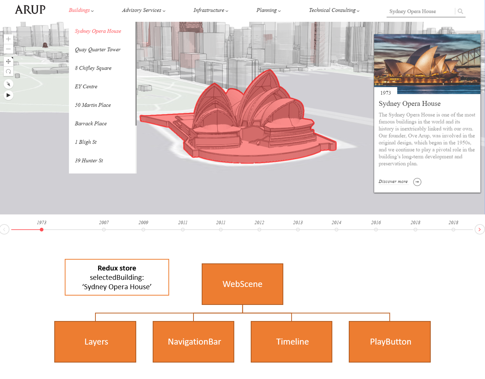

<!-- Presenter: Renardi Tanuwidjaja -->

#### Esri Developers Summit 2019
<br> 
## Building a React App with react-arcgis and ArcGIS JavaScript API
<br>
#### [Renardi Tanuwidjaja](renardi.tanuwidjaja@arup.com)

---

# Introduction

------

## A bit about myself...

- From Sydney, Australia <!-- .element: class="fragment" data-fragment-index="1" -->
- Background in Civil/Geotechnical Engineering <!-- .element: class="fragment" data-fragment-index="2" -->
- Work for Arup - engineering firm <!-- .element: class="fragment" data-fragment-index="3" -->
- Built environment and infrastructure industry - transport, highways, rail, maritime, aviation, bridges, building structures <!-- .element: class="fragment" data-fragment-index="4" -->

------

<!-- .slide: data-background-video="assets/videos/arupportfolio3d_16-9.mp4" -->
<!-- .slide: style="background: rgba(255, 255, 255, 0.7);" -->

## What will I be talking about?

React & ArcGIS JavaScript API

Case example: Arup Hero Projects 3D Portfolio

------

<!-- .slide: data-background-video="assets/videos/arupportfolio3d_16-9.mp4" -->
<!-- .slide: style="background: rgba(255, 255, 255, 0.7);" -->

- Overview of data management and workflow (back end)
- Developing the web app using React & ArcGIS JavaScript API (front end)

---

# Back end

------

## Workflow

 <!-- .element: style="border: none; box-shadow: none;" -->

---

# Front end

------

 <!-- .element: style="border: none; box-shadow: none;" -->

------

## React - what is it?

 <!-- .element: style="border: none; box-shadow: none; height: 100px; background: none; margin: 0;" -->

- JavaScript library for creating web applications and building UI <!-- .element: class="fragment" data-fragment-index="1" -->
- Components and states - decoupled and reusable <!-- .element: class="fragment" data-fragment-index="2" -->
- Reactive updates <!-- .element: class="fragment" data-fragment-index="3" -->
- Virtual DOM <!-- .element: class="fragment" data-fragment-index="4" -->

```
npm install create-react-app
```
<!-- .element: class="fragment" data-fragment-index="5" -->

------

## So how do we use ArcGIS JavaScript API to build a React app?

------

## react-arcgis

- A library of React components that uses the ArcGIS JavaScript API
- <a href="https://github.com/Esri/react-arcgis" target="_blank">react-arcgis github</a>

```
npm install @esri/react-arcgis
```

------

## WebScene component

```
import React, { Component } from "react";
import { WebScene } from "@esri/react-arcgis";
import "./Map.css";

class Map extends Component {
  state = {};

  render() {
    return (
      <div id="map-container">
        <WebScene
          mapProperties={{
            basemap: "gray"
          }}
          viewProperties={{
            center: [151.2093, -33.8688],
            zoom: 14
          }}
        />
      </div>
    );
  }
}

export default Map;
```

------

## Passing map and view props to children

```
class Map extends Component {
  render() {
    return (
      <div id="map-container">
        <WebScene>
          <Layers/>
        </WebScene>
      </div>
    );
  }
}

###

class Layers extends Component {
  render() {
    const { map, view } = this.props;
    return (
      <>
        <ArupBuildings map={map} view={view} />
        <BaseBuildings map={map} view={view} />
      </>
    );
  }
}

```

------

## SceneLayer component

```
componentWillMount() {
  const { map } = this.props;
  const renderer = coralRenderer;
  loadModules(["esri/layers/SceneLayer"]).then(
    ([SceneLayer]) => {
      this.layer = new SceneLayer({
        portalItem: {
          id: "4c7906366ba54ee0b447702852867986",
          portal: process.env.REACT_APP_BASEURL + "portal/"
        },
        title: "ArupBuildings",
        renderer
      });
      map.add(this.layer);
    }
  );
}
```

------

## Attribute popup

 <!-- .element: style="border: none; box-shadow: none;" -->

------

## Emotion - CSS in JS

 <!-- .element: style="border: none; box-shadow: none; height: 200px;" -->

```
npm install emotion
npm install @emotion/core
npm install @emotion/styled
```

------

## Adding UI components

 <!-- .element: style="border: none; box-shadow: none; height: 70vh;" -->

------

## Adding UI components

 <!-- .element: style="border: none; box-shadow: none; height: 70vh;" -->

------

## Adding UI components

 <!-- .element: style="border: none; box-shadow: none; height: 70vh;" -->

------

## Adding UI components

 <!-- .element: style="border: none; box-shadow: none; height: 70vh;" -->

------

## Adding UI components

 <!-- .element: style="border: none; box-shadow: none; height: 70vh;" -->

------

## Redux

 <!-- .element: style="border: none; box-shadow: none; height: 200px;" -->

- A library to help manage states
- State store

```
npm install redux
npm install redux-thunk
npm install react-redux
```

------

## App state

 <!-- .element: style="border: none; box-shadow: none; height: 70vh;" -->

------

## Handler function

```
export const handleClick = (project, map, view) => {
  this.props.setSelectedBuildings(selection)
  handleZoom(project, view)
  handlePopup(project, map, view)
}

export const handleZoom = (project, view) => {
  let zoomLocation = zoomLocations.find(item => item.project_name === project)
  view.goTo(
    {
      ...zoomLocation.location,
    },
    {
      speedFactor: 0.7,
    }
  )
}

export const handlePopup = (project, map, view) => {
  loadModules(['esri/tasks/support/Query']).then(([Query]) => {
    let featureLayer = map.layers.items.find(
      layer => layer.title === 'ArupBuildings'
    )
    let query = featureLayer.createQuery()
    query.where = "project_name = '" + project + "'"
    query.outFields = ['*']

    featureLayer.queryFeatures(query).then(function(response) {
      view.popup.open({
        features: [response.features[0]],
      })
    })
  })
}
```

---

# Thank you

